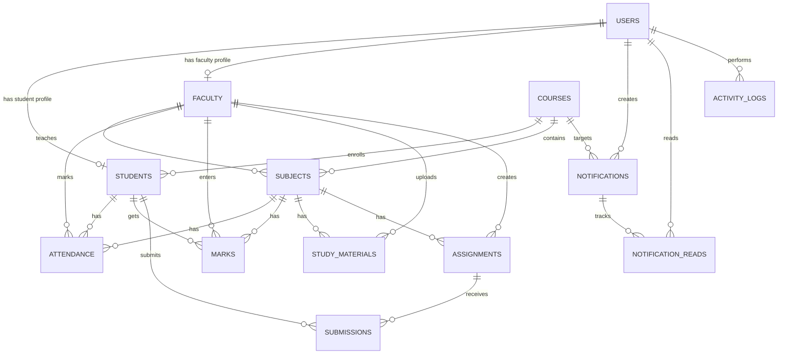

# Database Design

## Overview

PRAVA uses a relational database. In development, the project uses SQLite. Later, the same SQLAlchemy models can be migrated to MySQL with small configuration changes.

## Main Tables

| Table | Purpose |
| --- | --- |
| `users` | Login accounts for Admin, Faculty, and Student |
| `students` | Student academic profile linked with one user |
| `faculty` | Faculty academic profile linked with one user |
| `courses` | Course master data such as BCA |
| `subjects` | Semester-wise subjects assigned to faculty |
| `attendance` | Daily student attendance per subject |
| `marks` | Student marks per subject and exam type |
| `study_materials` | Uploaded study notes and files |
| `assignments` | Assignments created by faculty |
| `submissions` | Student assignment submissions |
| `notifications` | Announcements sent by Admin or Faculty |
| `notification_reads` | Read/unread tracking for notifications |
| `activity_logs` | Security and audit log entries |

## Important Constraints

- `users.username` and `users.email` are unique.
- `students.enrollment_number` is unique.
- `faculty.employee_id` is unique.
- A student can have only one attendance entry for the same subject on the same date.
- A student can have only one marks entry for the same subject and exam type.
- A student can have only one submission for the same assignment.
- Soft delete style fields such as `is_active` are used where records should not be removed permanently.

## ER Diagram

## Marathi Summary

या database design मध्ये प्रत्येक मोठ्या module साठी स्वतंत्र table आहे. `users` table login account ठेवतो आणि `students` / `faculty` tables profile details ठेवतात. Foreign key म्हणजे एका table मधील record दुसऱ्या table शी जोडणारा reference. Unique constraint मुळे duplicate attendance, duplicate marks आणि duplicate submissions थांबतात.
