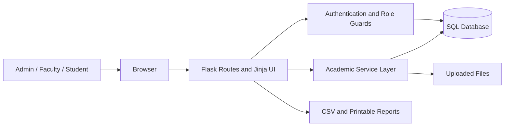

# PRAVA College Academic Management System

## Final Project Report

### Abstract

PRAVA is a web-based academic management system for colleges. It combines
student records, faculty work, attendance, marks, study materials, assignments,
notifications, and reports in one role-based application. Admin, Faculty, and
Student users see only the functions and records relevant to their role.

### Problem Statement

Academic information is often distributed across paper registers, spreadsheets,
chat messages, and separate files. This makes updates slow, duplicates work, and
makes it difficult for students to see current attendance, marks, assignments,
and notices. PRAVA provides one structured system for these workflows.

### Objectives

- Maintain centralized student, faculty, course, and subject records.
- Protect pages and actions with role-based access control.
- Let Faculty record attendance and marks for assigned subjects.
- Let Faculty publish materials, assignments, and notifications.
- Let Students view academic progress and submit assignments.
- Give Admin useful CSV and print-friendly reports.
- Preserve data integrity through validation and database constraints.
- Provide a secure, tested, and deployable Flask application.

### Scope

The current project supports one college and three user roles. It focuses on
academic operations rather than fees, payroll, library circulation, hostel
management, or online examinations.

### Technology Stack

| Layer | Technology |
| --- | --- |
| Frontend | HTML5, CSS3, JavaScript, Bootstrap 5, Bootstrap Icons |
| Backend | Python 3.12, Flask, Jinja2 |
| ORM and forms | Flask-SQLAlchemy, Flask-WTF, WTForms |
| Authentication | Flask-Login, Werkzeug password hashing, optional Supabase Auth |
| Development database | SQLite |
| Production database | PostgreSQL through Psycopg 3 |
| Production server | Gunicorn |
| Testing | Python `unittest`, Flask test client, in-memory SQLite |

### System Architecture



The Flask application factory loads environment-specific configuration and
registers separate blueprints for authentication, Admin, Faculty, Student, and
public core pages. Routes handle HTTP requests, service modules contain reusable
business rules, and SQLAlchemy models manage relational data.

### Main Modules

| Module | Important Functions |
| --- | --- |
| Authentication | Username/email login, logout, inactive account block, session handling |
| Admin | Student, faculty, course, subject, notification, and report management |
| Faculty | Profile, subjects, students, attendance, marks, materials, assignments, grading, notices |
| Student | Profile, subjects, attendance, marks, materials, assignments, submissions, notices |
| Reports | Student, faculty, attendance, marks, assignment, and notification CSV exports |
| Security | CSRF, role checks, safe redirects, password hashing, headers, error handling |

### Database Design

The database contains 13 main tables: users, students, faculty, courses,
subjects, attendance, marks, study_materials, assignments, submissions,
notifications, notification_reads, and activity_logs. Foreign keys connect
academic records, while unique constraints prevent duplicate usernames,
emails, enrollment numbers, employee IDs, attendance, marks, and submissions.

### Security Controls

- Passwords are stored as Werkzeug hashes, never plain text.
- Flask-Login protects sessions and role decorators protect module routes.
- Flask-WTF applies global CSRF protection to state-changing requests.
- Logout is a POST-only action.
- Post-login redirects accept only safe local paths.
- Production requires a strong secret key and secure cookies.
- CSP, frame, MIME, referrer, permissions, cache, and HSTS headers are set.
- Uploads use safe generated names, extension allowlists, and a 10 MB limit.
- Friendly errors avoid exposing stack traces to users.

### Testing

The automated suite uses an isolated in-memory SQLite database. It verifies
health status, security headers, password hashing, valid/invalid/inactive login,
role protection, safe redirects, CSRF, logout, custom errors, invalid sessions,
upload extensions, grade boundaries, production secrets, PostgreSQL URL
normalization, and first-Admin bootstrap.

```powershell
.\.venv\Scripts\python.exe -B -m unittest discover -s tests -p "test_*.py" -v
```

### Deployment

Development uses Flask's local server and SQLite. Production uses `wsgi.py`,
Gunicorn, PostgreSQL, environment secrets, and the included `render.yaml`
blueprint. The detailed process is in `docs/deployment_guide.md`.

### Limitations

- Public self-registration and Admin approval are not implemented.
- Password reset email workflow is not implemented.
- Local uploads need persistent disk or object storage in production.
- Database schema changes currently use `db.create_all`, not versioned migrations.
- Login rate limiting and malware scanning require deployment-level additions.

### Future Scope

- Student/faculty registration with Admin approval
- Password reset and verified email workflow
- Object storage for materials and submissions
- Alembic database migrations and automated backups
- Mobile application and push notifications
- Face-recognition attendance with consent and privacy controls
- Online examinations and analytics-based performance prediction

### Conclusion

PRAVA demonstrates a complete role-based full-stack college project. It turns
the original academic management requirements into working, tested modules and
provides a clear path from local demonstration to production deployment.
